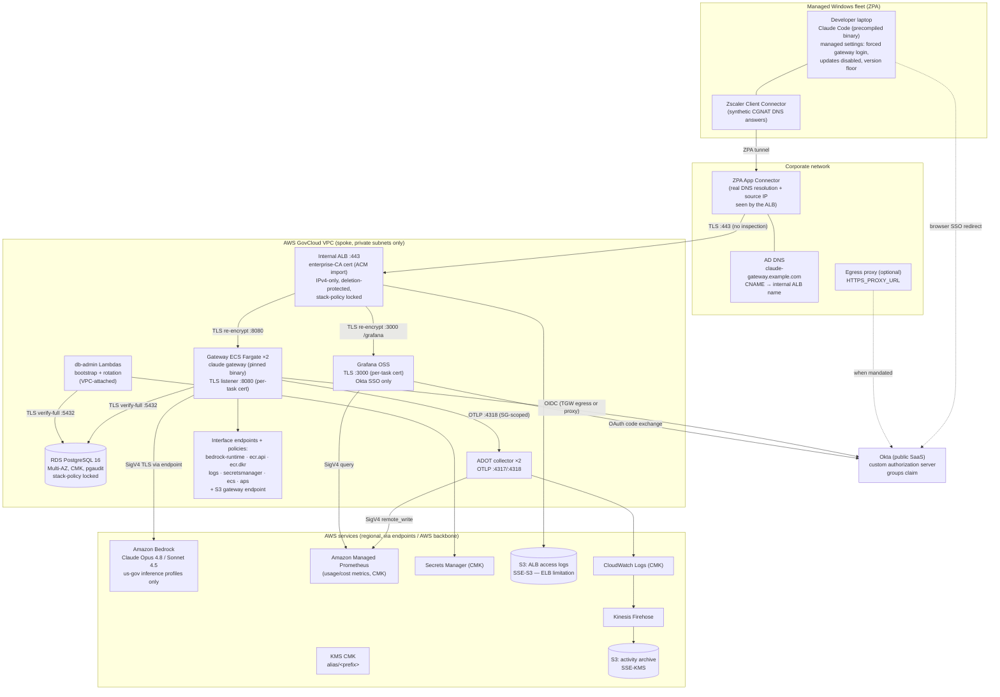
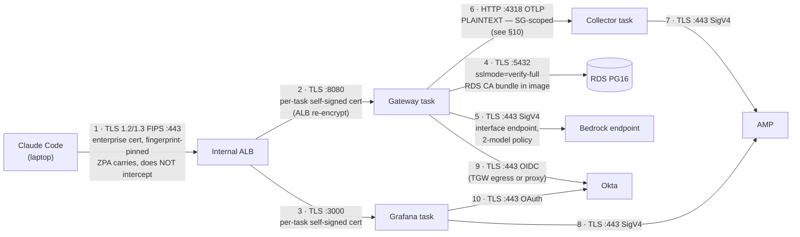
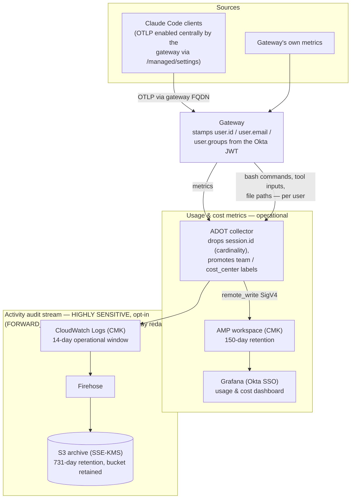
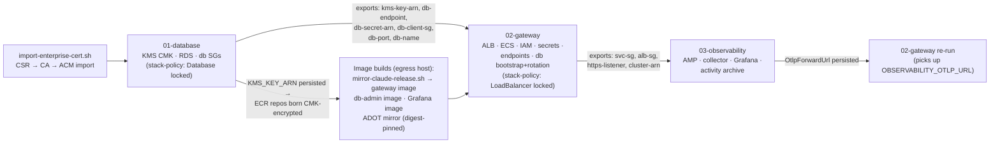

# Architecture & security review package

Diagrams and inventories for security/ATO review of the Claude apps
gateway deployment (AWS GovCloud `us-gov-west-1`). Everything here is
generated from the templates in `cloudformation/` at the commit this file
ships with — when the code and this document disagree, the code wins and
this file needs a PR.

The diagrams render inline below (GitHub renders Mermaid natively). Each
one also exists as a standalone source file under
[`docs/diagrams/`](diagrams/) — extracted verbatim from this document —
for exporting to PNG/SVG for a submission package
(`npx @mermaid-js/mermaid-cli -i docs/diagrams/<name>.mmd -o <name>.png`):

| Diagram | Source |
|---|---|
| §1 System architecture & trust boundaries | [`diagrams/01-system-architecture.mmd`](diagrams/01-system-architecture.mmd) |
| §2 Network flows, ports & TLS state | [`diagrams/02-network-flows-tls.mmd`](diagrams/02-network-flows-tls.mmd) |
| §3 Developer authentication | [`diagrams/03-developer-authentication-oidc.mmd`](diagrams/03-developer-authentication-oidc.mmd) |
| §4 DB credential lifecycle | [`diagrams/04-db-credential-lifecycle.mmd`](diagrams/04-db-credential-lifecycle.mmd) |
| §5 Telemetry & audit data flows | [`diagrams/05-telemetry-audit-data-flows.mmd`](diagrams/05-telemetry-audit-data-flows.mmd) |
| §8 Stack dependencies & deploy order | [`diagrams/06-stack-dependencies-deploy-order.mmd`](diagrams/06-stack-dependencies-deploy-order.mmd) |

Contents:

1. [System architecture & trust boundaries](#1-system-architecture--trust-boundaries)
2. [Network flows, ports & TLS state](#2-network-flows-ports--tls-state)
3. [Developer authentication (Okta OIDC)](#3-developer-authentication-okta-oidc)
4. [Database credential lifecycle](#4-database-credential-lifecycle)
5. [Telemetry & audit data flows](#5-telemetry--audit-data-flows)
6. [Secrets & key inventory](#6-secrets--key-inventory)
7. [Security-group matrix](#7-security-group-matrix)
8. [Stack dependencies & deploy order](#8-stack-dependencies--deploy-order)
9. [Data-at-rest encryption map](#9-data-at-rest-encryption-map)
10. [Known accepted risks / review notes](#10-known-accepted-risks--review-notes)

---

## 1. System architecture & trust boundaries

Four trust zones: the managed Windows fleet (Zscaler ZPA), the corporate
network (App Connectors + AD DNS + egress proxy), the AWS GovCloud VPC
(all workload components), and external SaaS (Okta — the single public
dependency; Bedrock and all other AWS services are reached over private
endpoints or the AWS backbone).



Key boundary statements for the reviewer:

- **No public ingress.** The ALB is internal; reaching it requires the ZPA
  app segment (or VPN) and an allow-listed connector source CIDR.
- **No public egress from the inference path.** Bedrock is reached via an
  interface endpoint whose policy allows exactly the two approved models;
  WebSearch is disabled on gateway sessions.
- **One public dependency:** the Okta issuer (OIDC has no VPC endpoint).
  Egress rides TGW central NAT or the mandated corporate proxy, port-scoped
  by security groups.
- **Client fleet never contacts Anthropic:** binaries are mirrored,
  checksum- and GPG-verified, and distributed from an internal share; all
  update paths are disabled by managed settings.

---

## 2. Network flows, ports & TLS state

Every hop, its port, protocol, and where the TLS session terminates.



| # | Hop | Port | Encryption | Server identity proven by |
|---|---|---|---|---|
| 1 | Laptop → ALB | 443 | TLS (FIPS policy) | Enterprise-CA cert; client pins SHA-256 fingerprint on first connect |
| 2 | ALB → gateway | 8080 | TLS | Per-task ephemeral cert (ALB does not validate targets; key never leaves task) |
| 3 | ALB → Grafana | 3000 | TLS | Per-task ephemeral cert (same model) |
| 4 | Gateway/Lambda → RDS | 5432 | TLS `verify-full` | RDS regional CA bundle baked into images; `rds.force_ssl=1` server-side |
| 5 | Gateway → Bedrock | 443 | TLS + SigV4 | AWS cert; endpoint policy = 2 approved models only |
| 6 | Gateway → collector | 4317–4318 | **Plaintext** | n/a — SG-to-SG scoped; see §10 |
| 7–8 | Collector/Grafana → AMP | 443 | TLS + SigV4 | AWS cert; endpoint policy = this workspace only |
| 9–10 | Gateway/Grafana → Okta | 443 | TLS | Public CA; only internet-bound flow |

---

## 3. Developer authentication (Okta OIDC)

```mermaid
sequenceDiagram
    autonumber
    participant CLI as Claude Code (laptop)
    participant B as Browser (laptop)
    participant ALB as Internal ALB
    participant GW as Gateway
    participant OK as Okta (custom auth server)

    Note over CLI: managed settings force<br/>forceLoginMethod=gateway,<br/>forceLoginGatewayUrl
    CLI->>ALB: /login → device authorization (TLS, pinned cert)
    ALB->>GW: re-encrypted
    GW-->>CLI: verification URL + user code
    CLI->>B: open browser to gateway auth URL
    B->>ALB: GET /oauth/... (via ZPA)
    GW->>B: 302 → Okta /v1/authorize
    B->>OK: authenticate (Okta MFA / policy)
    OK->>B: 302 → https://fqdn/oauth/callback?code=...
    B->>ALB: callback (via ZPA)
    ALB->>GW: code
    GW->>OK: code → token exchange (server-side,<br/>client_secret from Secrets Manager;<br/>via TGW egress or corporate proxy)
    OK-->>GW: id_token (email, groups)
    Note over GW: allowed_email_domains check;<br/>session JWT signed with jwt-secret,<br/>TTL = SessionTtlHours
    GW-->>CLI: gateway session established
    CLI->>GW: inference requests w/ session JWT
    GW->>GW: stamp user.id / user.email /<br/>user.groups onto telemetry
```

Grafana uses the **same issuer** with its own client and redirect URI
(`/grafana/login/generic_oauth`), strict Okta-group→role mapping
(`grafana-admins` → Admin; users in no mapped group are denied), PKCE, and
the local login form disabled (break-glass `admin` requires a redeploy
with `GRAFANA_DISABLE_LOGIN_FORM=false`).

**Identity chain for audit:** Okta identity → gateway session JWT → every
inference request and every telemetry export carries `user.id`/`user.email`/
`user.groups`. Per-source-IP attribution is deliberately not relied on
(ZPA collapses all users to connector IPs — documented in the README).

---

## 4. Database credential lifecycle

The gateway never holds the RDS master credential (AC-6). Identities:

| Postgres role | Kind | Powers | Used by |
|---|---|---|---|
| `gw` (master) | LOGIN, RDS-managed | `rds_superuser`-adjacent | Break-glass humans + db-admin Lambda only |
| `gateway_owner` | NOLOGIN | Owns schema objects; CONNECT/TEMPORARY/CREATE on the gateway DB only | Assumed at login by both app users |
| `gateway_app` / `gateway_app_clone` | LOGIN (alternating pair) | Via `SET role` → gateway_owner; **no CREATEROLE, no rds_superuser, cannot alter pgaudit** | Gateway tasks (exactly one is live) |

```mermaid
sequenceDiagram
    autonumber
    participant CFN as CloudFormation
    participant BL as Bootstrap Lambda
    participant SM as Secrets Manager
    participant PG as RDS Postgres
    participant RL as Rotation Lambda
    participant ECS as ECS service

    rect rgb(235, 244, 255)
    Note over CFN,PG: One-time bootstrap (stack create)
    CFN->>BL: Custom::DbAppUserBootstrap
    BL->>SM: read master secret (rds!...)
    BL->>PG: as master: create gateway_owner,<br/>gateway_app(+clone) w/ SET role,<br/>grants; adopt master-owned tables
    BL->>SM: write app secret v1<br/>{username: gateway_app, password, host...}
    BL-->>CFN: SUCCESS (retried responder)
    CFN->>ECS: create Service (DependsOn bootstrap);<br/>tasks inject PGUSER/PGPASSWORD<br/>from the app secret at launch
    end

    rect rgb(235, 255, 238)
    Note over SM,ECS: Every rotation (90d schedule + immediately at creation)
    SM->>RL: createSecret
    RL->>SM: stage AWSPENDING {other user, new pw}
    SM->>RL: setSecret
    RL->>PG: as master: ALTER ROLE other-user PASSWORD
    SM->>RL: testSecret
    RL->>PG: connect as other-user (verify-full) → SELECT 1
    SM->>RL: finishSecret
    RL->>SM: move AWSCURRENT → pending (idempotent)
    RL->>ECS: UpdateService forceNewDeployment
    Note over ECS: rolling deploy, MinimumHealthyPercent 100;<br/>new tasks fetch the flipped credential
    Note over PG: PREVIOUS user's password still valid<br/>until the NEXT rotation — running tasks<br/>never hold a dead credential
    end
```

Failure containment: a failed rotation step is retried by Secrets Manager;
a persistently failing rotation trips the `<prefix>-db-rotation-errors`
CloudWatch alarm. The RDS master secret keeps its RDS-managed 7-day
auto-rotation, which affects no running workload.

---

## 5. Telemetry & audit data flows

Two distinct streams with different sensitivity:



| Data class | Contains | Store | Retention | Access path |
|---|---|---|---|---|
| Usage metrics | tokens, cost, sessions, LoC, model, user identity, team/cost-center | AMP (CMK) | 150 d (AMP fixed) | Grafana via Okta SSO, role-mapped |
| Activity stream (opt-in) | bash commands, tool inputs, file paths, per user; prompt content redacted | CloudWatch (CMK) → S3 (SSE-KMS) | 14 d window / 731 d archive | IAM only; flagged for SIEM subscription |
| ALB access logs | source connector IPs, URIs, timings | S3 (SSE-S3) | 90 d | IAM only |
| DB audit (pgaudit) | DDL, role changes, writes (no bind values) | RDS → CloudWatch (CMK) | 365 d group | IAM only |
| Session/spend store | sessions, spend counters | RDS (CMK) | live | app DB user only |

---

## 6. Secrets & key inventory

One customer-managed KMS key (`alias/<prefix>`, rotation enabled, created
by the DB stack or bring-your-own) encrypts everything below except where
noted.

| Secret | Store / name | Created by | Consumed by | Rotation |
|---|---|---|---|---|
| RDS master (`gw`) | Secrets Manager `rds!...` | RDS-managed | **Humans (break-glass)** + db-admin Lambda | RDS-managed, 7 d auto |
| App DB user | `<prefix>/db-app-user` | Bootstrap Lambda | Gateway tasks (ECS injection at launch) | Stack's rotation Lambda, 90 d default, alternating users + service roll |
| Okta client secret (gateway) | `<prefix>/oidc-client-secret` | Stack (placeholder) → `set-okta-secret.sh` | Gateway tasks | Manual, in Okta + script (rolls service) |
| Okta client secret (Grafana) | `<prefix>/grafana-oidc-client-secret` | Stack (placeholder) → `set-grafana-oidc-secret.sh` | Grafana task | Manual, same pattern |
| JWT session-signing secret | `<prefix>/jwt-secret` | Stack (generated) | Gateway tasks | Manual runbook: prepend → roll → remove |
| Grafana `admin` password | `<prefix>/grafana-admin-password` | Stack (generated) | Break-glass only (login form disabled) | Manual |
| TLS: enterprise leaf + key | ACM import | Enterprise CA via `import-enterprise-cert.sh` | ALB listener | Manual re-import; `DaysToExpiry` alarm at 30 d |
| TLS: per-task certs | Generated in-container at startup | Gateway / Grafana entrypoints | ALB target connections | Every task launch; keys never leave the task |

Handling rules embedded in tooling: secret values never appear on argv
(`file://` + mode-600 temp files), never in CloudFormation parameters,
and the two `set-*-secret.sh` scripts roll their consuming service.

---

## 7. Security-group matrix

Default egress is removed from **every** group (inline rules replace the
allow-all); the table is the complete connectivity graph.

| SG | Ingress | Egress |
|---|---|---|
| `alb` | 443 from `CLIENT_INGRESS_CIDR` (ZPA connector subnets) | 8080 → `svc`; 3000 → `grafana` (added by 03); otherwise none |
| `svc` (gateway tasks) | 8080 from `alb` | 443 → 0.0.0.0/0 (Okta + AWS via endpoints/TGW); proxy port when configured; 4317–4318 → `collector` (added by 03); 5432 via attached `db-client` |
| `db-client` (attached to tasks + db-admin Lambdas) | — | 5432 → `db` only |
| `db` | 5432 from `db-client` | none |
| `db-admin` (Lambdas) | — | 443 → 0.0.0.0/0 (Secrets Manager, ECS APIs) |
| `collector` | 4317–4318 from `svc` | 443 → 0.0.0.0/0 (AMP, CloudWatch) |
| `grafana` | 3000 from `alb` | 443 → 0.0.0.0/0 (AMP, Okta); proxy port when configured |
| `endpoints` / `amp-endpoint` | 443 from `svc` / `db-admin` (resp. `collector`+`grafana`) | none |

DNS to the VPC resolver is exempt from SG evaluation (AWS platform
behavior) and is why no port-53 rules appear.

---

## 8. Stack dependencies & deploy order



Export locks (documented in README "Teardown & update order"): while a
downstream stack imports an export, the upstream stack cannot change its
value — most notably the RDS storage CMK is a **day-one decision**, and
03 must be deleted before 02 replacement-updates. The ALB and Database
additionally carry CloudFormation **stack policies** denying
`Update:Replace`/`Update:Delete`, so an accidental template change that
would recreate them (new ALB DNS name → client DNS resubmission; new
empty database) fails fast.

---

## 9. Data-at-rest encryption map

| Store | Encryption | Key |
|---|---|---|
| RDS storage + snapshots | SSE | CMK |
| RDS master secret / all Secrets Manager secrets | SSE | CMK |
| CloudWatch log groups (ECS ×3, activity) | SSE | CMK |
| Activity archive bucket | SSE-KMS + bucket key | CMK |
| AMP workspace | SSE | CMK (`ENCRYPT_AMP_WITH_CMK`, creation-time) |
| ECR repositories | SSE-KMS at creation | CMK (when created after 01) |
| ALB access-logs bucket | SSE-S3 (AES-256) | **AWS-managed — ELB log delivery does not support KMS** |

---

## 10. Known accepted risks / review notes

Items a reviewer should see up front, with rationale (full history in
`security-review-2026-07.md`):

1. **Gateway→collector OTLP hop is plaintext** (§2 hop 6). SG-to-SG scoped
   (only gateway tasks can connect); VPC traffic is not sniffable by other
   tenants. Encrypting it requires an enterprise-CA-signed collector cert
   in a custom collector image + the CA root in the gateway trust store
   (the gateway validates telemetry TLS against the system store only).
   Documented recipe on the collector task definition; implement if the
   SSP rejects the VPC-boundary argument for SC-8.
2. **ALB access logs cannot use the CMK** — AWS platform limitation;
   SSE-S3 with public access blocked and lifecycle expiry.
3. **S3 Object Lock deferred** by decision (2026-07-15); revisit if AU-9
   WORM retention is mandated.
4. **Egress 443 to 0.0.0.0/0 from tasks** — required for Okta (public
   SaaS, no VPC endpoint, IP ranges not pinnable); mitigated by port
   scoping, endpoint policies for all AWS traffic, and the central
   inspection layer in the landing zone.
5. **Foundation-model IAM region wildcard** (`bedrock:*::foundation-model/
   <exact-model>`) — required because GovCloud geo inference profiles fan
   out across us-gov regions; model IDs are exact.
6. **First app-secret rotation is asynchronous** — the stack goes green
   regardless; verify via the db-rotation log group / errors alarm after
   first deploy.
