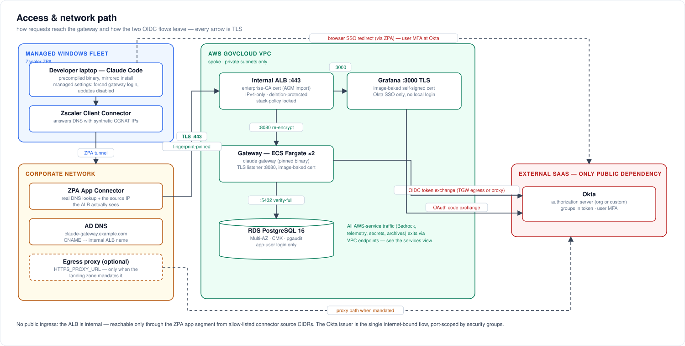
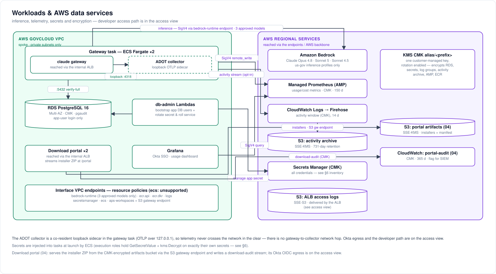
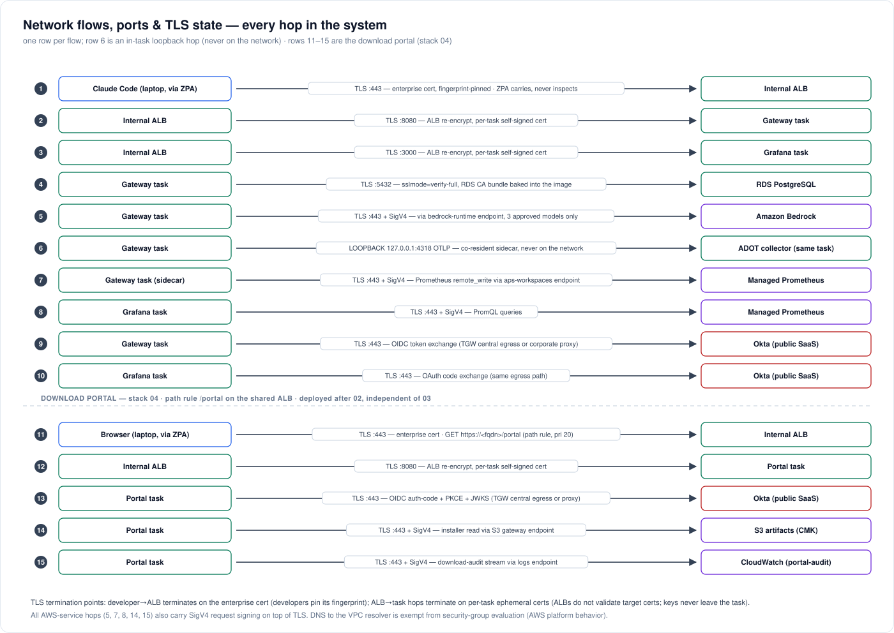
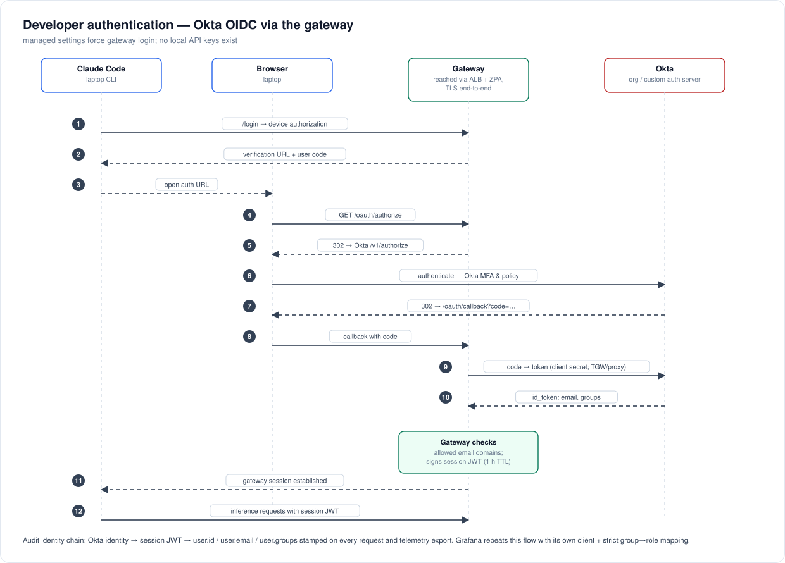
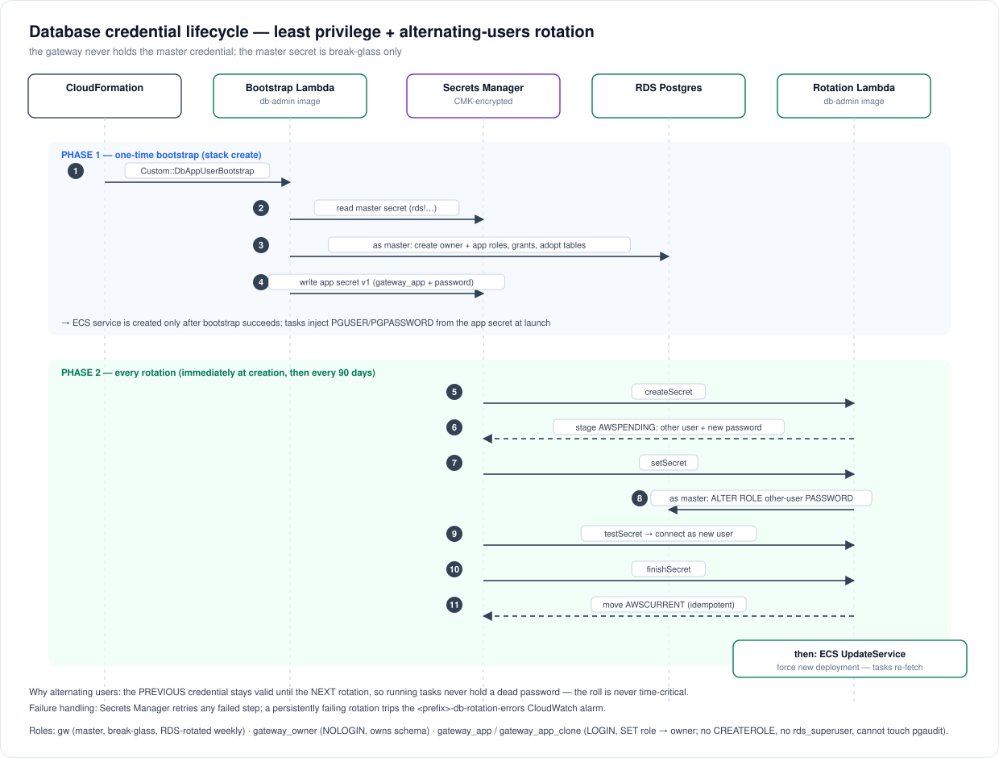
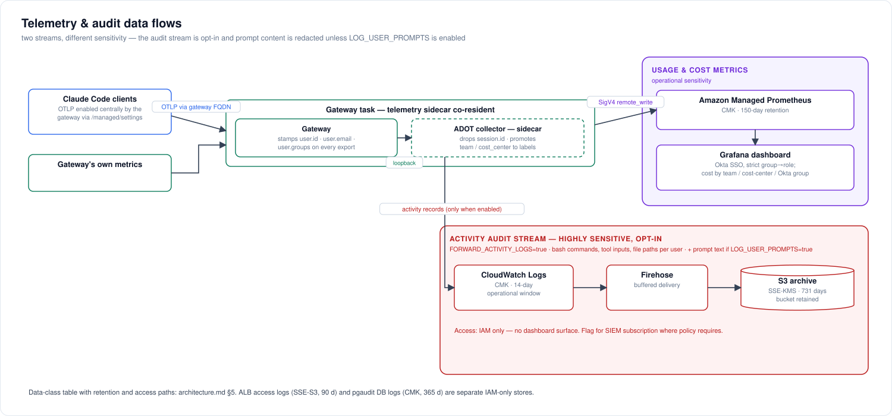
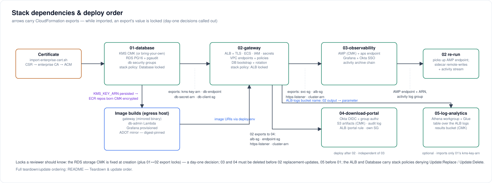
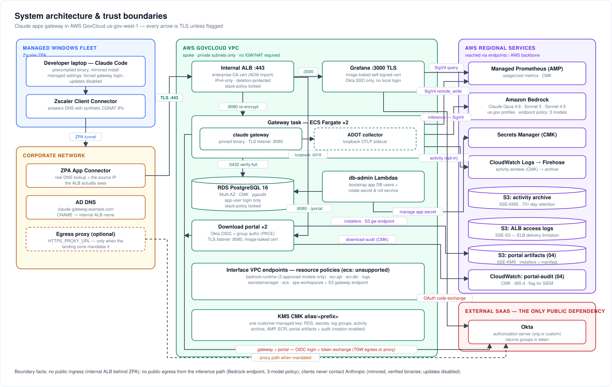

# Architecture & security review package

Diagrams and inventories for security/ATO review of the Claude apps
gateway deployment (AWS GovCloud `us-gov-west-1`). Everything here is
generated from the templates in `cloudformation/` at the commit this file
ships with — when the code and this document disagree, the code wins and
this file needs a PR.

The diagrams are hand-laid-out SVGs under [`docs/ato/diagrams/`](diagrams/),
generated by [`docs/ato/diagrams/generate.py`](diagrams/generate.py) (edit the
script, re-run it, and commit both). SVGs print cleanly and embed directly
in submission documents; for PNG exports:
`python3 -c "import cairosvg; cairosvg.svg2png(url='docs/ato/diagrams/<name>.svg', write_to='<name>.png', scale=2)"`.

Contents:

1. [System architecture & trust boundaries](#1-system-architecture--trust-boundaries)
2. [Network flows, ports & TLS state](#2-network-flows-ports--tls-state)
3. [Developer authentication (Okta OIDC)](#3-developer-authentication-okta-oidc)
4. [Database credential lifecycle](#4-database-credential-lifecycle)
5. [Telemetry & audit data flows](#5-telemetry--audit-data-flows)
6. [Secrets & key inventory](#6-secrets--key-inventory)
7. [Security-group matrix](#7-security-group-matrix)
8. [Stack dependencies & deploy order](#8-stack-dependencies--deploy-order)
9. [Data-at-rest encryption map](#9-data-at-rest-encryption-map)
10. [Known accepted risks / review notes](#10-known-accepted-risks--review-notes)
11. [Appendix — combined system view](#appendix--combined-system-view)

---

## 1. System architecture & trust boundaries

Four trust zones: the managed Windows fleet (Zscaler ZPA), the corporate
network (App Connectors + AD DNS + egress proxy), the AWS GovCloud VPC
(all workload components), and external SaaS (Okta — the single public
dependency; Bedrock and all other AWS services are reached over private
endpoints or the AWS backbone). Two complementary views; the combined
single-page version is in the [appendix](#appendix--combined-system-view).

**Access & network path** — how requests reach the gateway and how the
OIDC flows leave:

**Workloads & AWS data services** — inference, telemetry, secrets and
encryption inside AWS:

Key boundary statements for the reviewer:

- **No public ingress.** The ALB is internal; reaching it requires the ZPA
  app segment (or VPN) and an allow-listed connector source CIDR.
- **No public egress from the inference path.** Bedrock is reached via an
  interface endpoint whose policy allows exactly the three approved models;
  WebSearch is disabled on gateway sessions.
- **One public dependency:** the Okta issuer (OIDC has no VPC endpoint).
  Egress rides TGW central NAT or the mandated corporate proxy, port-scoped
  by security groups.
- **Client fleet never contacts Anthropic:** binaries are mirrored,
  checksum- and GPG-verified, and distributed from an internal share; update
  paths are disabled via the installer's user settings (and optionally the
  gateway's central push), and the mirror-only network path is the backstop.

---

## 2. Network flows, ports & TLS state

Every hop, its port, protocol, and where the TLS session terminates.

| # | Hop | Port | Encryption | Server identity proven by |
|---|---|---|---|---|
| 1 | Laptop → ALB | 443 | TLS (FIPS policy) | Enterprise-CA cert; client pins SHA-256 fingerprint on first connect |
| 2 | ALB → gateway | 8080 | TLS | Self-signed leaf generated on the build host and baked into the image (ALB does not validate targets; the key is identical across every task running that image and rotates only on the next image rebuild) |
| 3 | ALB → Grafana | 3000 | TLS | Self-signed leaf baked into the Grafana image (same build-time model) |
| 4 | Gateway/Lambda → RDS | 5432 | TLS `verify-full` | RDS regional CA bundle baked into images; `rds.force_ssl=1` server-side |
| 5 | Gateway → Bedrock | 443 | TLS + SigV4 | AWS cert; endpoint policy = 3 approved models only |
| 6 | Gateway → collector (sidecar) | 4317–4318 | Loopback — no network hop | Same Fargate task; the collector is a localhost sidecar with its receiver bound to `127.0.0.1`, so nothing off-task can reach it (see §10) |
| 7–8 | Gateway sidecar / Grafana → AMP | 443 | TLS + SigV4 | AWS cert; endpoint policy = this workspace only |
| 9–10 | Gateway/Grafana → Okta | 443 | TLS | Public CA; only internet-bound flow |

---

## 3. Developer authentication (Okta OIDC)

Grafana uses the **same issuer** with its own client and redirect URI
(`/grafana/login/generic_oauth`), strict Okta-group→role mapping
(`grafana-admins` → Admin; users in no mapped group are denied), PKCE, and
the local login form disabled (break-glass `admin` requires a redeploy
with `GRAFANA_DISABLE_LOGIN_FORM=false`).

**Identity chain for audit:** Okta identity → gateway session JWT → every
inference request and every telemetry export carries `user.id`/`user.email`/
`user.groups`. Per-source-IP attribution is deliberately not relied on
(ZPA collapses all users to connector IPs — documented in the README).

---

## 4. Database credential lifecycle

The gateway never holds the RDS master credential (AC-6). Identities:

| Postgres role | Kind | Powers | Used by |
|---|---|---|---|
| `gw` (master) | LOGIN, RDS-managed | `rds_superuser`-adjacent | Break-glass humans + db-admin Lambda only |
| `gateway_owner` | NOLOGIN | Owns schema objects; CONNECT/TEMPORARY/CREATE on the gateway DB only | Assumed at login by both app users |
| `gateway_app` / `gateway_app_clone` | LOGIN (alternating pair) | Via `SET role` → gateway_owner; **no CREATEROLE, no rds_superuser, cannot alter pgaudit** | Gateway tasks (exactly one is live) |

Failure containment: a failed rotation step is retried by Secrets Manager;
a persistently failing rotation trips the `<prefix>-db-rotation-errors`
CloudWatch alarm. The RDS master secret keeps its RDS-managed 7-day
auto-rotation, which affects no running workload.

---

## 5. Telemetry & audit data flows

Two distinct streams with different sensitivity:

| Data class | Contains | Store | Retention | Access path |
|---|---|---|---|---|
| Usage metrics | tokens, cost, sessions, LoC, model, user identity, team/cost-center | AMP (CMK) | 150 d (AMP fixed) | Grafana via Okta SSO, role-mapped |
| Activity stream (opt-in) | bash commands, tool inputs, file paths, per user; prompt content redacted | CloudWatch (CMK) → S3 (SSE-KMS) | 14 d window / 731 d archive | IAM only; flagged for SIEM subscription |
| ALB access logs | source connector IPs, URIs, timings | S3 (SSE-S3) | 90 d | IAM only; SQL-searchable via the optional Athena stack (05) — results land CMK-encrypted |
| DB audit (pgaudit) | DDL, role changes, writes (no bind values) | RDS → CloudWatch (CMK) | 365 d group | IAM only |
| Session/spend store | sessions, spend counters | RDS (CMK) | live | app DB user only |

---

## 6. Secrets & key inventory

One customer-managed KMS key (`alias/<prefix>`, rotation enabled, created
by the DB stack or bring-your-own) encrypts everything below except where
noted.

| Secret | Store / name | Created by | Consumed by | Rotation |
|---|---|---|---|---|
| RDS master (`gw`) | Secrets Manager `rds!...` | RDS-managed | **Humans (break-glass)** + db-admin Lambda | RDS-managed, 7 d auto |
| App DB user | `<prefix>/db-app-user` | Bootstrap Lambda | Gateway tasks (ECS injection at launch) | Stack's rotation Lambda, 90 d default, alternating users + service roll |
| Okta client secret (gateway) | `<prefix>/oidc-client-secret` | Stack (placeholder) → `set-okta-secret.sh` | Gateway tasks | Manual, in Okta + script (rolls service) |
| Okta client secret (Grafana) | `<prefix>/grafana-oidc-client-secret` | Stack (placeholder) → `set-grafana-oidc-secret.sh` | Grafana task | Manual, same pattern |
| Okta client secret (portal) | `<prefix>/portal-oidc-client-secret` | Stack 04 (placeholder) → `set-portal-oidc-secret.sh` | Portal tasks | Manual, same pattern |
| JWT session-signing secret | `<prefix>/jwt-secret` | Stack (generated) | Gateway tasks | Manual runbook: prepend → roll → remove |
| Portal session-signing secret | `<prefix>/portal-session-secret` | Stack 04 (generated) | Portal tasks | Manual (regenerate + roll) |
| Grafana `admin` password | `<prefix>/grafana-admin-password` | Stack (generated) | Break-glass only (login form disabled) | Manual |
| Spend-admin write key | `<prefix>/spend-admin-write-key` | Stack (generated) | Gateway task only (config's `admin:` block recognizes it as the write-scope bearer token); break-glass via `set-spend-limit.sh` — no other task is ever handed this key | Manual, not automatic (`GenerateSecretString` at create); procedure in `cost-controls.md` §7 |
| Spend-admin read key | `<prefix>/spend-admin-read-key` | Stack (generated) | Gateway task (`admin:` block) **and** the download portal (04, imported via the `<prefix>-spend-read-key-arn` export) for `/portal/me` self-usage and the admin listing view | Manual, not automatic; rolling it means re-deploying both the gateway and portal services (`cost-controls.md` §7) |
| TLS: enterprise leaf + key | ACM import | Enterprise CA via `import-enterprise-cert.sh` | ALB listener | Manual re-import; `DaysToExpiry` alarm at 30 d |
| TLS: image-baked certs (gateway, Grafana, portal) | Self-signed leaf generated with `openssl` on the build host, then `COPY`-ed into the image at `docker build` time — the image itself carries no `openssl` | `build-and-push-image.sh` / `build-and-push-grafana.sh` / `build-and-push-portal.sh` | ALB target connections (hops 2–3 in §2) | Every image rebuild, not per task launch; the key is an ECR image-layer artifact, identical across every task running that image tag until the next rebuild |

Handling rules embedded in tooling: secret values never appear on argv
(`file://` + mode-600 temp files), never in CloudFormation parameters,
and the two `set-*-secret.sh` scripts roll their consuming service.

---

## 7. Security-group matrix

Default egress is removed from **every** group (inline rules replace the
allow-all); the table is the complete connectivity graph.

> **Deep dive with diagrams:** [`network-access-controls.md`](network-access-controls.md)
> maps every SG rule pair visually (diagram 7), inventories each group
> (diagram 8), and traces one API call through all five enforcement layers -
> SGs, endpoint SG, endpoint policies, IAM, KMS (diagram 9).

| SG | Ingress | Egress |
|---|---|---|
| `alb` | 443 from `CLIENT_INGRESS_CIDR` (ZPA connector subnets) | 8080 → `svc`; 3000 → `grafana` (added by 03); 8080 → `portal` (added by 04); otherwise none |
| `svc` (gateway tasks, incl. the ADOT collector sidecar) | 8080 from `alb` | 443 → 0.0.0.0/0 (Okta + AWS via endpoints/TGW; the sidecar's AMP/CloudWatch traffic rides this SG); proxy port when configured; 443 → `amp-endpoint` (added by 03, for the sidecar's AMP remote-write); 5432 via attached `db-client` |
| `db-client` (attached to tasks + db-admin Lambdas) | — | 5432 → `db` only |
| `db` | 5432 from `db-client` | none |
| `db-admin` (Lambdas) | — | 443 → 0.0.0.0/0 (Secrets Manager, ECS APIs) |
| `grafana` | 3000 from `alb` | 443 → 0.0.0.0/0 (AMP, Okta); proxy port when configured |
| `portal` (download portal, 04) | 8080 from `alb` | 443 → 0.0.0.0/0 (Okta, S3, CloudWatch); proxy port when configured |
| `endpoints` / `amp-endpoint` | 443 from `svc` / `db-admin` (resp. `svc` (gateway sidecar) + `grafana` + `portal`) | none |

DNS to the VPC resolver is exempt from SG evaluation (AWS platform
behavior) and is why no port-53 rules appear.

---

## 8. Stack dependencies & deploy order

Export locks (documented in README "Teardown & update order"): while a
downstream stack imports an export, the upstream stack cannot change its
value — most notably the RDS storage CMK is a **day-one decision**, and
03 must be deleted before 02 replacement-updates. The optional
log-analytics stack (05: Athena + Glue over the ALB access logs) imports
only 01's CMK export; its deploy script reads 02's `AlbLogsBucketName`
stack output and passes it as a parameter — deliberately not an export, so
02 gains no new export lock. The ALB and Database
additionally carry CloudFormation **stack policies** denying
`Update:Replace`/`Update:Delete`, so an accidental template change that
would recreate them (new ALB DNS name → client DNS resubmission; new
empty database) fails fast.

---

## 9. Data-at-rest encryption map

| Store | Encryption | Key |
|---|---|---|
| RDS storage + snapshots | SSE | CMK |
| RDS master secret / all Secrets Manager secrets | SSE | CMK |
| CloudWatch log groups (ECS gateway [+ its collector sidecar, stream prefix `otel`], grafana/portal, activity, portal-audit, RDS postgresql/pgaudit, db-admin Lambdas) | SSE | CMK — every group is template-declared (never service-auto-created) precisely so the CMK and retention apply; all carry `DeletionPolicy: Retain`, so no log group is destroyed by a stack teardown |
| Activity archive bucket | SSE-KMS + bucket key | CMK |
| Portal artifacts bucket (04) | SSE-KMS + bucket key | CMK |
| Athena query-results bucket (05, optional) | SSE-KMS + bucket key (workgroup-enforced) | CMK |
| AMP workspace | SSE | CMK (`ENCRYPT_AMP_WITH_CMK`, creation-time) |
| ECR repositories | SSE-KMS at creation | CMK (when created after 01) |
| ALB access-logs bucket | SSE-S3 (AES-256) | **AWS-managed — ELB log delivery does not support KMS** |

---

## 10. Known accepted risks / review notes

Items a reviewer should see up front, with rationale (finding-by-finding
detail in `security-assessment-2026-07.md`):

1. **There is no gateway→collector OTLP network hop** (§2 hop 6). The
   gateway refuses a non-HTTPS telemetry forward URL unless the host is
   localhost, and an internal-CA TLS listener would add a cert + CA the
   gateway must trust (an SC-17/SC-12 burden the org declined). The collector
   therefore runs as a **localhost sidecar** inside the gateway task: the
   gateway forwards over loopback (`http://localhost:4318`), so SC-8 is met by
   absence of transmission rather than by encryption. This requires
   `CLAUDE_GATEWAY_ALLOW_LOOPBACK=1` on the gateway container (its SSRF guard
   blocks loopback by default); the override is gated on telemetry being
   enabled and re-permits only loopback — EC2 IMDS and link-local addresses
   stay blocked. The gateway task role is the telemetry writer to AMP + the
   activity log group (scoped to this workspace and this log group).
2. **ALB access logs cannot use the CMK** — AWS platform limitation;
   SSE-S3 with public access blocked and lifecycle expiry.
3. **S3 Object Lock deferred** by decision; revisit if AU-9 WORM retention
   is mandated.
4. **Egress 443 to 0.0.0.0/0 from tasks** — required for Okta (public
   SaaS, no VPC endpoint, IP ranges not pinnable); mitigated by port
   scoping, endpoint policies for all AWS traffic, and the central
   inspection layer in the landing zone.
5. **Foundation-model IAM region wildcard** (`bedrock:*::foundation-model/
   <exact-model>`) — required because GovCloud geo inference profiles fan
   out across us-gov regions; model IDs are exact.
6. **First app-secret rotation is asynchronous** — the stack goes green
   regardless; verify via the db-rotation log group / errors alarm after
   first deploy.
7. **The ALB→task TLS key (§2 hops 2–3, §6) is an image-build artifact, not
   a per-task secret.** It is generated once on the build host and baked
   into the gateway/Grafana/portal images; every task running a given image
   tag presents the identical key, and any principal able to pull that
   image (ECR read access) can extract it. This only protects the
   ALB-to-target hop — the ALB does not validate target certificates, and
   client trust is anchored to the enterprise leaf on the ALB listener, not
   this key — so the exposure is bounded to that hop; rotation is achieved
   by rebuilding and re-pushing the image under a new tag.

---

## Appendix — combined system view

Everything from §1 on a single page — denser than the split views above,
useful when a reviewer wants the whole system at a glance.

