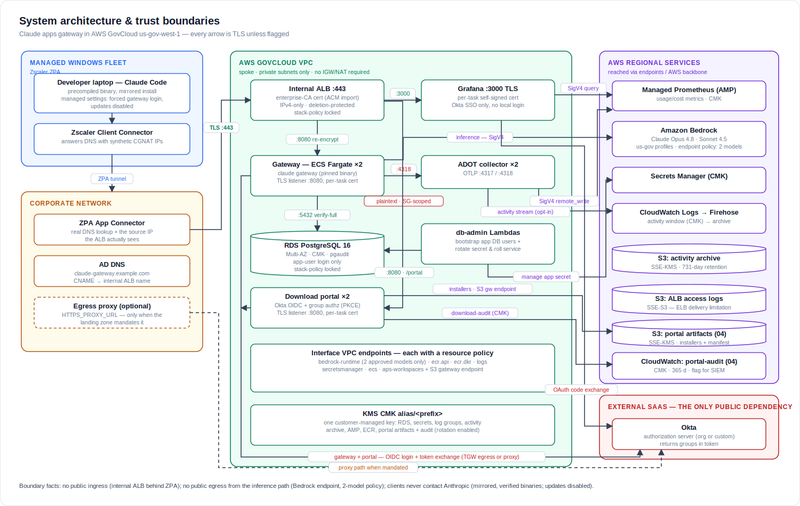
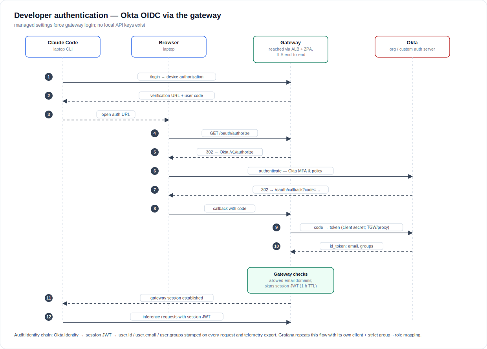

# Concept of Operations (ConOps) — Claude apps gateway (AWS GovCloud)

Companion to the security-review package
([`architecture.md`](architecture.md),
[`network-access-controls.md`](network-access-controls.md),
[`security-review-2026-07.md`](security-review-2026-07.md)) for the RMF/FedRAMP
ATO submission. Where those documents describe *what the system is built from*,
this one describes *how it is operated and used*: who the users are, what they
do, how the system behaves in normal and degraded modes, and what the operating
organization must provide. It is written for ISSO/AO reviewers who have not read
the repository.

This deployment is a **client-configurable template**, not a single fielded
system: every organization-specific value (gateway FQDN, Okta issuer, email
domains, model IDs, network CIDRs, account IDs) is a CloudFormation parameter or
a `scripts/deploy.env` variable. Placeholders in this document
(`claude-gateway.example.com`, `grafana-admins`) stand in for those values.

Where the architecture is already documented, this ConOps **references** the
diagrams and inventories rather than restating them. When code and prose
disagree, the CloudFormation templates in `cloudformation/` are authoritative.

---

## 1. Purpose and scope

### 1.1 Purpose

The system is a **self-hosted gateway that lets developers use Claude Code (the
Anthropic coding agent) entirely inside the organization's AWS GovCloud
boundary.** Developer requests never leave to a public Anthropic endpoint;
model inference is served from **Amazon Bedrock** within GovCloud
(`us-gov-west-1`), authenticated by the organization's own **Okta** identity
provider, and recorded in the organization's own audit and observability stores.
The gateway exists so that an approved-model, identity-attributed, fully
in-boundary path to Claude can be offered to developers on managed Windows
laptops without a public internet dependency on the AI provider.

### 1.2 Scope — what the system is

- An **internal Application Load Balancer + ECS Fargate gateway** service that
  terminates developer TLS, authenticates users via Okta OIDC, and proxies
  inference to Bedrock (`cloudformation/02-gateway.yaml`).
- An **RDS PostgreSQL** store for session and spend state
  (`cloudformation/01-database.yaml`).
- An **offline Windows client rollout**: a mirrored, integrity-verified
  `claude` binary and a non-admin installer that writes managed settings
  (`client/mirror-claude-release.sh`, `client/Install-ClaudeCode.ps1`).
- An **optional usage/cost observability stack**: Amazon Managed Prometheus
  (AMP), an ADOT collector, and a self-hosted Grafana behind the same ALB and
  IdP (`cloudformation/03-observability.yaml`).

### 1.3 Scope — what the system is not

- **Not public-facing.** The ALB is internal; there is no public ingress path
  (`architecture.md` §1, "No public ingress").
- **Not a general AI gateway.** Exactly two Bedrock models are exposed — Opus
  4.8 and Sonnet 4.5 — enforced at the application, IAM, and VPC-endpoint layers
  (`cloudformation/02-gateway.yaml` `models:` block; `architecture.md` §10 note
  5).
- **Not dependent on Anthropic-hosted infrastructure at runtime.** The client
  fleet never contacts Anthropic: binaries are mirrored and verified, and all
  auto-update paths are disabled by managed settings
  (`client/mirror-claude-release.sh`, `client/Install-ClaudeCode.ps1`).
- **Not a Node/npm distribution.** By decision (2026-07-15), only the
  precompiled native `claude` binary is fielded (CLAUDE.md "User decisions").

### 1.4 System boundary

The authorization boundary comprises four trust zones — the managed Windows
fleet (Zscaler ZPA), the corporate network (App Connectors, AD DNS, egress
proxy), the AWS GovCloud workload VPC (all server components), and one external
SaaS dependency, Okta. Bedrock and every other AWS service are reached over
private endpoints or the AWS backbone. The single-page boundary view is
reproduced below; the split views and per-hop detail are in `architecture.md`
§1–§2.

---

## 2. System overview

At a glance (full detail in `architecture.md` §1–§2):

- Developers on managed Windows laptops run `claude`, which reaches an
  **internal ALB** over TLS via **Zscaler ZPA**. The ALB re-encrypts to the
  **ECS Fargate gateway** tasks (per-task TLS), which authenticate the user
  against **Okta OIDC** and proxy inference to **Bedrock** over a private
  interface endpoint whose policy admits only the two approved models.
- **Session and spend state** lives in **RDS PostgreSQL 16**; the gateway
  connects as a least-privilege application role, never the RDS master user.
- **Usage telemetry** (tokens, cost, model, and stamped user identity) flows
  from the gateway to an **ADOT collector**, into **AMP**, and is visualized in
  a self-hosted **Grafana** that also authenticates through Okta.
- Everything at rest is encrypted with a single **customer-managed KMS key**
  (the one documented exception is the ALB access-logs bucket, which uses SSE-S3
  because ELB log delivery does not support KMS — `architecture.md` §9).

The deployment is three CloudFormation stacks (`01` database, `02` gateway, `03`
observability) plus four container images and a `deploy.env`-driven set of
scripts. Stack dependencies and deploy order are in `architecture.md` §8.

---

## 3. Users and roles

The system has four operational actor classes. None of the day-to-day roles
holds the RDS master credential.

### 3.1 End-user developers

- Run `claude` on managed, Zscaler-secured Windows laptops via a **non-admin**
  install to the per-user profile (`client/Install-ClaudeCode.ps1`; the
  installer refuses a SYSTEM-context binary install and offers a settings-only
  mode for MDM pushes).
- Authenticate interactively through **Okta SSO** at first `/login` and receive
  a gateway session (`cloudformation/02-gateway.yaml` `oidc:` and `session:`
  blocks).
- Are gated at sign-in by **allowed email domain**
  (`allowed_email_domains` in `cloudformation/02-gateway.yaml`, from the
  `ALLOWED_EMAIL_DOMAINS` parameter). Okta **group** claims are available but
  are **not yet enforced** as gateway access control: the `groups` scope and the
  `managed.policies` group-match block are present but commented out in the
  template (`cloudformation/02-gateway.yaml`, lines around the `oidc:` and
  `managed:` sections). Reviewers should read gateway authorization today as
  "authenticated Okta user in an approved email domain," with per-group policy
  as an available, unexercised extension.

### 3.2 Platform operators

- Deploy and maintain the system with the `deploy.env`-driven scripts in
  `scripts/` (fixed order: cert → `01` → build four images → `02` →
  DNS/Zscaler → verify → `03` → Grafana secret → re-run `02`;
  `docs/test-run-runbook.md`).
- Operate from a host with Docker, AWS credentials, and egress; an **in-VPC
  admin/build host** is admitted to the interface-endpoint security group when
  `ADMIN_CLIENT_SG_ID` is set, so its AWS API calls are not black-holed by the
  endpoints' private DNS (`network-access-controls.md` §1; `security-review`
  batch, endpoint-SG cross-stack reachability).
- Never inject the RDS master secret into any task; the deploy tooling writes
  secrets via mode-600 `file://` temp files, never on the command line
  (`.claude/rules/security.md`; `scripts/common.sh` `put_secret_and_roll`).

### 3.3 Security and audit consumers

- Read the **DB audit trail** (pgaudit → CloudWatch), **ALB access logs** (S3),
  and, when enabled, the **AI activity stream** (see §5.4).
- The activity stream is treated as highly sensitive (bash commands, tool
  inputs, file paths per user): it is **opt-in**, IAM-only, CMK-encrypted, and
  flagged for SIEM subscription (`.claude/rules/security.md`;
  `cloudformation/03-observability.yaml`; `FORWARD_ACTIVITY_LOGS` in
  `scripts/deploy.env.example`).

### 3.4 Break-glass database administrator

- The RDS master role (`gw`) is **break-glass only** — held by humans for
  emergencies and by the db-admin Lambda, never by a running gateway task
  (`architecture.md` §4; `.claude/rules/security.md`). Its RDS-managed 7-day
  rotation therefore affects no running workload.

### 3.5 Grafana / dashboard role model

Grafana authenticates against the **same Okta issuer** as the gateway, with its
own client and redirect URI (`/grafana/login/generic_oauth`) and **strict
Okta-group → role mapping**: membership in `grafana-admins` (the
`GRAFANA_ADMIN_GROUP` parameter, default `grafana-admins`) maps to Grafana
Admin, and a user in no mapped group is **denied** (`architecture.md` §3;
`cloudformation/03-observability.yaml`; `docs/okta-request-email.md`). The local
login form is disabled; the bootstrap `admin` account is break-glass only,
reachable only by redeploying with `GRAFANA_DISABLE_LOGIN_FORM=false`.

---

## 4. Operational environment

The system is fielded into an **AWS Landing Zone** with the following
characteristics (CLAUDE.md "Landing zone"; `security-review-2026-07.md` target
profile):

- **Hub-and-spoke with Transit Gateway** (not VPC peering), **central egress**;
  the workload VPC is a **no-NAT spoke** in the target profile. Because there is
  no local NAT, the no-NAT path relies on interface/gateway VPC endpoints for
  AWS APIs (`CREATE_SUPPORTING_ENDPOINTS`, `CREATE_BEDROCK_ENDPOINT`,
  `CREATE_AMP_ENDPOINT` in `scripts/deploy.env.example`).
- **Client access via Zscaler ZPA**: developer laptops reach the internal ALB
  through a ZPA application segment for the gateway FQDN (TCP 443), served by App
  Connectors that route to the workload VPC over the Transit Gateway. TLS
  inspection must **not** be enabled on that segment — the client pins the
  gateway certificate fingerprint (`docs/networking-request-email.md` §3).
- **Server-side egress prerequisite**: the gateway and Grafana containers dial
  the **Okta issuer** for OIDC discovery and token exchange. This traffic is
  server-originated (no Zscaler user identity), so the workload VPC's central
  egress path needs an explicit **ALLOW + SSL-inspection exemption** for the
  Okta issuer FQDN (`docs/networking-request-email.md`, "Server-side egress").
  This is the single open org prerequisite blocking the first end-to-end run
  (CLAUDE.md Status).
- **Corporate DNS**: a single CNAME in the corporate zone points the gateway
  FQDN at the ALB's `internal-*.elb.amazonaws.com` name — a public record
  returning private IPs, so no split-horizon/private-hosted-zone is required;
  App Connectors must be able to resolve the corporate CNAME
  (`docs/networking-request-email.md` §2; `security-review-2026-07.md` B1).

Per-source-IP attribution is deliberately **not** relied upon: ZPA collapses all
users to a handful of App Connector IPs, so identity is carried in the Okta →
gateway-session chain, not the network layer (`architecture.md` §3;
`security-review-2026-07.md` B8).

---

## 5. Operational scenarios

The narrative walkthroughs below are the core of this ConOps. Each traces a real
flow through the fielded system and cites the file that implements it.

### 5.1 Developer onboarding and first login

1. **Offline install.** An operator has mirrored the pinned `claude` release
   into an internal share; the mirror **fails closed** on integrity — it refuses
   to proceed without GPG verification unless `ALLOW_UNVERIFIED_MANIFEST=1` is
   set explicitly (`client/mirror-claude-release.sh`;
   `.claude/rules/security.md`). The developer (or an MDM push) runs
   `Install-ClaudeCode.ps1`, which installs the binary to the per-user profile
   **without admin rights** and writes **managed settings** that point the CLI
   at the gateway and lock down auto-updates (`DISABLE_UPDATES=1`,
   `DISABLE_AUTOUPDATER=1`) (`client/Install-ClaudeCode.ps1`).
2. **First login (Okta OIDC).** The developer runs `claude`, chooses the cloud
   gateway login, and is taken through the Okta authorization-code flow (PKCE,
   org authorization server). On success the gateway issues a session JWT that
   carries the Okta identity. The full sequence is diagrammed in
   `architecture.md` §3.

   

3. **Certificate fingerprint trust.** Claude Code validates the ALB certificate
   chain, then **pins the SHA-256 fingerprint of the leaf on first connect**
   (trust-on-first-use, per hostname). Operators publish the expected
   fingerprint (printed by `import-enterprise-cert.sh`) so the developer
   confirms it at first login. This is exactly why TLS inspection must not sit
   in front of the gateway FQDN (`docs/networking-request-email.md` §3;
   `docs/test-run-runbook.md` §1).

### 5.2 Normal use — a request

Steady-state request path (`architecture.md` §2, hop table):

Laptop `claude` → **ZPA** (TCP 443, no inspection) → **internal ALB** (TLS,
FIPS policy) → **gateway task** (ALB re-encrypts to per-task TLS on 8080) →
**Bedrock** (TLS + SigV4 over the interface endpoint, two approved models only).
Session and spend state is read and written in **RDS** over `verify-full` TLS,
with the gateway authenticating as the least-privilege application role
(`gateway_app` / `gateway_app_clone`), never the master user (`architecture.md`
§4). WebSearch is disabled on gateway sessions, so the inference path has no
public egress (`architecture.md` §1).

### 5.3 Usage and cost monitoring

Each developer's managed settings can stamp **OTEL resource attributes** —
`cost_center` and `team` — via `OTEL_RESOURCE_ATTRIBUTES`, set by the installer's
`-CostCenter` / `-Team` parameters (`client/Install-ClaudeCode.ps1`). The
gateway additionally stamps **identity** (`user.id` / `user.email` /
`user.groups` from the Okta session) onto every telemetry export
(`architecture.md` §3, §5). Metrics flow gateway → **ADOT collector** →
**AMP** (SigV4 remote-write) → **Grafana**, where operators authenticate through
Okta SSO and read the provisioned usage/cost dashboard
(`cloudformation/03-observability.yaml`; `architecture.md` §5). Metrics carry
150-day AMP retention.

### 5.4 Audit

Three independent audit surfaces, at increasing sensitivity (`architecture.md`
§5 data-flow table):

- **DB audit (pgaudit).** DDL, role changes, and writes (no bind values) are
  exported from RDS to a CMK-encrypted CloudWatch log group
  (`cloudformation/01-database.yaml`; `security-review-2026-07.md` C4).
- **ALB access logs.** Source connector IPs, URIs, and timings land in an S3
  bucket (SSE-S3, IAM-only, lifecycle expiry) (`cloudformation/02-gateway.yaml`;
  `architecture.md` §9 note).
- **AI activity stream (opt-in, highly sensitive).** When
  `FORWARD_ACTIVITY_LOGS=true`, bash commands, tool inputs, and file paths per
  user are streamed to a CMK-encrypted CloudWatch window and archived to S3
  (SSE-KMS), IAM-only and flagged for SIEM subscription
  (`cloudformation/03-observability.yaml`; `scripts/deploy.env.example`;
  `.claude/rules/security.md`). Prompt content is redacted. This stream's access
  surface is deliberately never widened.

### 5.5 Administration — deploy, update, and rotation

- **Deploy / update flow.** The load-bearing order is cert → `01` database →
  build all four images → `02` gateway → DNS/Zscaler → `verify-gateway.sh` →
  `03` observability → set Grafana Okta secret → re-run `02`
  (`docs/test-run-runbook.md`; CLAUDE.md "Deploy model"). Scripts persist their
  outputs back into `deploy.env` (`set_env_var` in `scripts/common.sh`), so
  there are no copy-paste steps. Container image tags are immutable — an image
  change means a new tag and a service roll (`.claude/rules/scripts.md`).
- **Automated DB-credential rotation.** The application DB secret
  (`<prefix>/db-app-user`) rotates on a schedule (default 90 days,
  `APP_SECRET_ROTATION_DAYS`) using an **alternating-user** scheme — the
  db-admin Lambda flips between `gateway_app` and `gateway_app_clone` and
  **forces the gateway service to roll** as part of `finishSecret`
  (`docker/db-admin/app.py`; `architecture.md` §4). The previous credential
  stays valid until the next rotation. The first rotation fires at stack
  creation as an automatic end-to-end validation (asynchronous — see §8).
- **Manual secret rotation.** Okta client secrets (gateway and Grafana) are set
  out-of-band via `set-okta-secret.sh` / `set-grafana-oidc-secret.sh`, which
  prompt hidden, write via mode-600 `file://`, and roll the consuming service
  (`scripts/common.sh` `put_secret_and_roll`). The JWT session-signing secret
  has a documented prepend → roll → remove runbook (`architecture.md` §6).

---

## 6. Modes of operation

### 6.1 Normal

All three stacks healthy: developers log in through Okta, inference is served
from Bedrock, telemetry flows to Grafana, and audit surfaces are recording.

### 6.2 Degraded

- **Observability stack (03) down → gateway unaffected.** Telemetry forwarding
  is optional and gated on the observability stack existing; the deploy-gateway
  guard only disables forwarding on a definitively-missing stack, and a gateway
  with no OTLP target continues to serve inference. Usage dashboards go stale;
  developer service does not (`cloudformation/02-gateway.yaml` telemetry toggle;
  `security-review-2026-07.md` self-review notes on the telemetry guard).
- **Okta unreachable → no new logins, existing sessions continue.** OIDC is the
  authentication front door; if the issuer is unreachable (or the server-side
  egress ALLOW/exemption is missing), **new** logins fail closed, but sessions
  already holding a valid JWT keep working until their TTL expires
  (`SESSION_TTL_HOURS`; `cloudformation/02-gateway.yaml` `session:` block). This
  is the failure the current org prerequisite would otherwise cause at boot
  (CLAUDE.md Status).
- **Collector redeploy → brief telemetry gap.** The collector runs ≥1 task
  (default 2, `CollectorDesiredCount`) specifically to avoid a telemetry
  blackout on redeploy (`security-review-2026-07.md` D6).

### 6.3 Maintenance

- **Image updates.** Rebuild and push the affected image under a **new immutable
  tag**, then roll the service; always push rebuilt images *before* a stack
  update that changes what the task definition expects
  (`.claude/rules/scripts.md`).
- **Certificate rotation.** The enterprise leaf is imported into ACM and does
  **not** auto-renew; a `DaysToExpiry` alarm fires at 30 days, and re-import
  re-triggers a one-time client fingerprint-trust prompt, so operators
  coordinate a heads-up before each renewal (`architecture.md` §6;
  `docs/networking-request-email.md` §1).
- **Teardown / replacement discipline.** The ALB and RDS instance are protected
  three ways (deletion protection, fixed names, stack policy denying
  replace/delete); several encryption-at-rest choices (RDS CMK, AMP CMK) are
  **day-one decisions** that cannot be changed by an in-place update
  (`architecture.md` §8; `.claude/rules/cloudformation.md`).

Detailed operations-and-maintenance procedures are collected in the O&M runbooks
document, `docs/om-runbooks.md` (authored as a parallel deliverable; forward
reference).

---

## 7. Security posture summary and accepted risks

Stated up front, per the review-package convention. The source of truth for
finding-by-finding status is `security-review-2026-07.md`; the accepted-risk
register is `architecture.md` §10.

The implemented posture: a single customer-managed KMS key encrypts everything
at rest (bar the ALB-logs bucket, an ELB platform limitation); TLS in transit on
every hop except one internal telemetry leg (below); RDS `verify-full`; pgaudit;
VPC-endpoint and IAM policies scoped to the two approved models and this
account's exact ARNs; explicit (no default-allow) security-group egress; and a
least-privilege application DB user with self-rolling rotation. Full batch status
(A deploy-breakers, B ZPA/landing-zone prerequisites, C FedRAMP hardening C1–C11,
D correctness, C12 least-privilege DB user) is in `security-review-2026-07.md`.

**Accepted / deferred risks a reviewer should see immediately:**

- **C2 — gateway → collector OTLP hop is plaintext (SC-8), by design, partial.**
  The single telemetry leg from the gateway to the ADOT collector (ports
  4317–4318) is unencrypted, compensated by **SG-to-SG scoping** — only gateway
  tasks can reach the collector ports. Encrypting it requires an
  enterprise-CA-signed collector cert plus the CA root in the gateway trust
  store; the recipe is documented on the collector task definition. Implement if
  the SSP rejects the VPC-boundary argument for SC-8
  (`security-review-2026-07.md` C2; `architecture.md` §10 note 1).
- **C9 — S3 Object Lock / WORM on audit buckets is deferred**, by decision
  (2026-07-15). Revisit if AU-9 WORM retention is mandated
  (`security-review-2026-07.md` C9; `architecture.md` §10 note 3).
- **ALB access-logs bucket uses SSE-S3, not the CMK** — an AWS platform
  limitation (ELB log delivery does not support KMS), not an oversight; the
  bucket blocks public access and expires on a lifecycle (`architecture.md` §9,
  §10 note 2).

---

## 8. Assumptions, constraints, and dependencies

### 8.1 Assumptions and constraints

- **GovCloud model availability.** Only **Opus 4.8**
  (`us-gov.anthropic.claude-opus-4-8`) and **Sonnet 4.5**
  (`us-gov.anthropic.claude-sonnet-4-5-20250929-v1:0`) are available in
  `us-gov-west-1`; Sonnet 4.6 / Sonnet 5 are not. Model IDs must be verified
  against the Bedrock console before changing defaults
  (`scripts/deploy.env.example`; CLAUDE.md "GovCloud model availability").
- **Template, not a deployment.** No organization-specific value is hardcoded;
  each is a CloudFormation parameter or a `deploy.env` variable
  (`.claude/rules/security.md`).
- **Client distribution is the precompiled native binary only** (decision
  2026-07-15); Grafana auth is Okta SSO; Object Lock is deferred (CLAUDE.md
  "User decisions").

### 8.2 Organizational dependencies (prerequisites)

These must be provided by the operating organization before the system can
operate; templates for the requests exist in the repo:

- **Enterprise-CA TLS certificate** for the gateway FQDN (serverAuth EKU),
  imported into ACM (`docs/networking-request-email.md` §1;
  `scripts/import-enterprise-cert.sh`).
- **Internal DNS CNAME** for the gateway FQDN at the ALB name
  (`docs/networking-request-email.md` §2).
- **Zscaler policy**: a ZPA app segment (or ZIA bypass) for the gateway FQDN
  with no TLS inspection, **and** the server-side egress ALLOW +
  SSL-inspection exemption for the Okta issuer FQDN
  (`docs/networking-request-email.md` §3).
- **Okta OIDC application** — a confidential Web app on the org authorization
  server, both redirect URIs registered, groups returned, and the admin group
  provisioned (`docs/okta-request-email.md`).

### 8.3 Verification status — verified on paper vs. verified live

Per the "done means verified live" discipline (`.claude/rules/process.md`), the
following is stated honestly for reviewers:

- **First end-to-end test run is IN PROGRESS** (as of 2026-07-17). Proven live
  so far: DB bootstrap and app-user auth, RDS `verify-full` TLS, offline image
  builds on a hardened host, ALB + access logs, and the endpoint-SG reachability
  model (CLAUDE.md Status).
- **Currently blocked** on one org prerequisite — the Zscaler ALLOW +
  SSL-inspection exemption for the Okta issuer FQDN on server-side egress —
  which the gateway needs for OIDC discovery at boot (CLAUDE.md Status;
  `docs/networking-request-email.md`).
- **Still unexercised** and therefore not yet claimed as fielded: gateway steady
  state and end-to-end developer login, Grafana Okta login, secret rotation, and
  the activity archive (CLAUDE.md Status; `security-review-2026-07.md` "What
  remains"). The system is not production-ready until the runbook's validation
  checklist (`docs/test-run-runbook.md` §9) is green.
