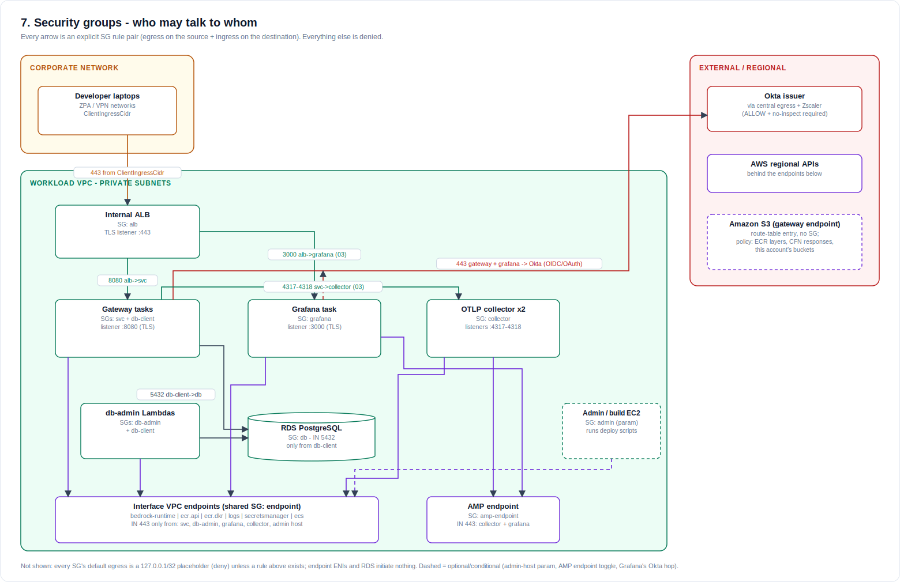
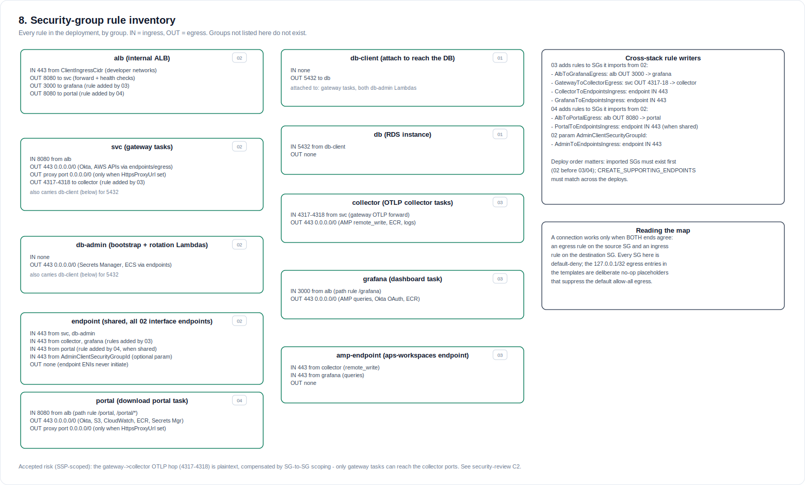
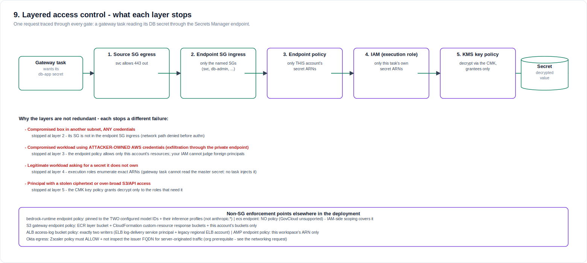

# Network access controls — security groups, endpoint policies, and the layers between

Companion to [`architecture.md`](architecture.md), answering one question in
depth: **who is allowed to talk to what, and which mechanism enforces it.**
Three visuals carry the story; the tables give the exact rules. Diagrams are
generated by [`diagrams/generate.py`](diagrams/generate.py) — regenerate
rather than hand-editing the SVGs.

**Accepted risks, up front** (SSP-scoped decisions, not oversights):

- The `ecs` interface endpoint carries **no endpoint policy** — GovCloud does
  not support one there; IAM-side scoping covers it.
- The ALB access-logs bucket is SSE-S3, not CMK — ELB log delivery does not
  support KMS.

---

## 1. The map — who may talk to whom

Every arrow is an explicit SG rule *pair*: an egress rule on the source group
**and** an ingress rule on the destination group. A connection with only one
half configured does not work; a connection with neither is dropped silently.
Every group suppresses default egress with a `127.0.0.1/32` placeholder, so
nothing here is reachable "by default."

Reading tips:

- **Workloads carry more than one SG.** The gateway tasks run with
  `svc` + `db-client`; the db-admin Lambdas with `db-admin` + `db-client`.
  Attaching 01's `db-client` group is *the* mechanism for "may reach the
  database" — nothing else is ever granted 5432.
- **The interface endpoints are the chokepoint.** Their private DNS captures
  AWS API calls from **every** VPC client, so any in-VPC caller of
  ecr/logs/secretsmanager/ecs — including the admin/build host — must appear
  in the endpoint SG's ingress or its calls black-hole (this bit the first
  test run twice).
- **Okta is the only external dependency** the workloads dial out to; it
  rides the landing zone's central egress and needs the Zscaler
  ALLOW + no-inspect prerequisite (see `networking-request-email.md`).

## 2. The inventory — every rule, by group

| SG | Stack | Attached to | Ingress | Egress |
|---|---|---|---|---|
| `alb` | 02 | internal ALB | 443 from `ClientIngressCidr` | 8080→`svc`; 3000→`grafana` (03) |
| `svc` | 02 | gateway tasks (incl. the co-resident **ADOT collector sidecar**) | 8080 from `alb` | 443 anywhere; proxy port (optional); 443→`amp-endpoint` (03) |
| `db-client` | 01 | gateway tasks, db-admin Lambdas | — | 5432→`db` |
| `db` | 01 | RDS instance | 5432 from `db-client` | — |
| `db-admin` | 02 | bootstrap + rotation Lambdas | — | 443 anywhere |
| `endpoint` | 02 | all 02 interface endpoints | 443 from `svc`, `db-admin`, `grafana` (03), admin host (param) | — |
| `grafana` | 03 | Grafana task | 3000 from `alb` | 443 anywhere |
| `amp-endpoint` | 03 | aps-workspaces endpoint | 443 from `svc` (gateway sidecar), `grafana` | — |

There is **no `collector` security group**: the ADOT collector is a
co-resident sidecar inside the gateway task, reached over loopback
(`127.0.0.1:4318`), so its OTLP receiver is never on the network and needs no
SG rule (this eliminated the former plaintext gateway→collector hop — security
review C2, resolved 2026-07-22). The sidecar's remote-write to AMP rides the
gateway `svc` SG.

Cross-stack rule writers (03 and the admin-host parameter modify imported 02
SGs as separate `SecurityGroup{In,E}gress` resources): `AlbToGrafanaEgress`,
`GrafanaToEndpointsIngress`, `GatewayToAmpEndpointEgress` (the sidecar's
remote-write path, which replaced the former `GatewayToCollectorEgress` /
`CollectorToEndpointsIngress`), `AdminToEndpointsIngress`. Deploy order (02
before 03) and a matching `CREATE_SUPPORTING_ENDPOINTS` across both deploys
are what make these land correctly.

## 3. The layers — what each control stops that the others can't

SGs are one of **five** gates on the path of a single AWS API call. The
diagram traces a gateway task reading its DB secret; the failure table under
it is the reason none of the layers is redundant — the second row
(attacker-owned credentials exfiltrating *through* a private endpoint) is the
one SGs and your own IAM cannot stop alone, and is why every endpoint carries
a resource policy.

Endpoint/resource policies in force:

| Where | Policy scope |
|---|---|
| `bedrock-runtime` endpoint | the **two configured model IDs** + their inference profiles — not `anthropic.*` |
| `ecr.api` / `ecr.dkr` endpoints | auth token (no-resource) + this account's repositories |
| `logs` endpoint | this account's log groups |
| `secretsmanager` endpoint | this deployment's secret ARNs + `GetRandomPassword` |
| `ecs` endpoint | **none** (unsupported in GovCloud) — IAM covers |
| S3 gateway endpoint | ECR layer bucket, CloudFormation custom-resource response buckets, this account's buckets |
| `aps-workspaces` endpoint (03) | this AMP workspace's ARN only |
| ALB access-logs bucket | exactly two writers: ELB log-delivery service principal + legacy regional ELB account |

IAM and KMS (layers 4–5) are inventoried in `architecture.md` §6 — the short
version: execution roles enumerate exact secret ARNs, the task role holds
`bedrock:InvokeModel*` on exactly the two models, and the single CMK's key
policy names its grantees.

---

*Change discipline: a new workload that needs the database gets `db-client`
attached (never a new 5432 rule); a new in-VPC caller of AWS APIs gets an
ingress on the `endpoint` SG (or it will black-hole); anything touching the
endpoint SG or the observability SGs should re-check the cross-stack
reachability findings in `security-review-2026-07.md`.*
